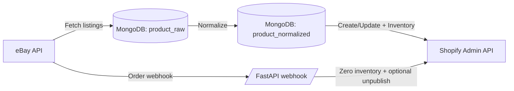

# eBay → Shopify Sync (Middleware)

FastAPI-based middleware that synchronizes eBay listings into Shopify.

**Planned next:** adding Etsy inventory into the same orchestration layer (fetch → normalize → publish/sync). This repo is structured to support additional marketplaces with the same MongoDB-backed pipeline.

**Note for Etsy reviewers:** Etsy is **not integrated yet** in the current codebase, and there are **no Etsy API calls** today. The Etsy work is scoped and tracked under the “Roadmap (Etsy)” section below.

## What this service does

**Data flow**

1. **Fetch from eBay** (Trading API): active listings via `GetMyeBaySelling` + per-item detail via `GetItem`
2. **Persist raw documents** to MongoDB (`product_raw`)
3. **Normalize/enrich** into a Shopify-friendly shape (`product_normalized`)
4. **Sync to Shopify** (Admin REST API): create/update products + keep inventory aligned
5. **Handle eBay order webhooks**: set corresponding Shopify inventory to `0` and optionally set product status to `draft`

Mermaid overview:



## Key features

- **Async I/O** throughout (FastAPI + Motor + aiohttp)
- **Dev/Prod separation** for Shopify credentials via `/sync/dev/*` and `/sync/prod/*`
- **Inventory correctness**: updates Shopify inventory using `inventory_item_id + location_id` when available, with a fallback variant-based method
- **Shopify rate limiting** built in (2 req/s) in `ShopifyClient`
- **Hard exclusions**: block specific normalized docs from ever syncing to Shopify via `BLOCKED_SHOPIFY_TAGS`
- **Optional LLM enrichment**: OpenAI integration is present and only activates when `OPENAI_API_KEY` is set

## Repo structure

- `app/` — FastAPI app, API routes, services, platform clients
- `app/ebay/` — eBay Trading API client + fetch logic
- `app/normalizer/` — normalization pipeline helpers
- `app/shopify/` — Shopify API client + product/inventory operations
- `scripts/` — one-off scripts for manual operations and backfills
- `static/` — simple admin page served at `/admin`

## Requirements

- Python 3.12
- MongoDB connection string
- eBay developer app credentials (OAuth)
- Shopify Admin API credentials

## Configuration

This project uses Pydantic Settings and reads environment variables from `.env` (see `app/config.py`).

### Required env vars

```bash
# Mongo
MONGO_URI=mongodb://localhost:27017
MONGO_DB=ebay_shopify_sync

# eBay OAuth
EBAY_APP_ID=...
EBAY_CERT_ID=...
EBAY_DEV_ID=...
EBAY_RUNAME=...   # eBay RuName / redirect-uri identifier from the eBay developer portal

# Optional fallback token (legacy/manual; DB OAuth is preferred)
EBAY_OAUTH_TOKEN=

# Shopify (DEV)
SHOPIFY_API_KEY=...
SHOPIFY_PASSWORD=...
SHOPIFY_STORE_URL=your-store.myshopify.com

# Shopify (PROD)
SHOPIFY_API_KEY_PROD=...
SHOPIFY_PASSWORD_PROD=...
SHOPIFY_STORE_URL_PROD=your-prod-store.myshopify.com

# Optional
OPENAI_API_KEY=
```

## Local development

```bash
python -m venv venv
source venv/bin/activate
pip install -r requirements.txt

uvicorn app.main:app --host 0.0.0.0 --port 8080 --reload
```

- API root: `http://localhost:8080/`
- Swagger UI: `http://localhost:8080/docs`
- Admin page: `http://localhost:8080/admin`

### Quick endpoint reference

- `GET /` — service status
- `GET /health` — simple health check (also available as `GET /health/`)
- `GET /products/?limit=50` — list normalized products from MongoDB
- `POST /sync/dev/*` — development Shopify store operations
- `POST /sync/prod/*` — production Shopify store operations
- `GET /auth/ebay/*` — eBay OAuth login/callback/status
- `GET|POST /webhooks/ebay/orders` — eBay order webhook endpoints

## Docker

```bash
docker build -t ebay-shopify-sync .
docker run --rm -p 8080:8080 --env-file .env ebay-shopify-sync
```

## How to run a sync

This service exposes **step-by-step** endpoints and also has a few helper scripts.

### 1) Authorize eBay (OAuth)

1. Visit: `GET /auth/ebay/login`
2. After authorizing, eBay redirects to `GET /auth/ebay/callback`
3. Verify token status: `GET /auth/ebay/status`

Tokens are stored in MongoDB in the `ebay_oauth_tokens` collection (document id `primary`).

### 2) Fetch raw eBay listings

- Dev: `POST /sync/dev/sync-ebay-raw`
- Prod: `POST /sync/prod/sync-ebay-raw`

Writes to `product_raw` (upsert by SKU). SKUs not returned in the latest fetch are marked with `raw.QuantityAvailable = 0` to propagate ended/sold items downstream.

### 3) Normalize raw → normalized

- Dev: `POST /sync/dev/normalize-raw`
- Prod: `POST /sync/prod/normalize-raw`

Writes to `product_normalized`.

### 4) Sync normalized → Shopify

- Dev: `POST /sync/dev/sync-shopify`
- Prod: `POST /sync/prod/sync-shopify`

Body is optional and defaults to syncing everything:

```json
{"new_products": true, "zero_inventory": true, "other_updates": true}
```

Additional targeted endpoints:

- Create only new products (no updates):
	- Dev: `POST /sync/dev/sync-shopify-new?limit=50`
	- Prod: `POST /sync/prod/sync-shopify-new?limit=50`
- Inventory-only enforcement:
	- Dev: `POST /sync/dev/sync-shopify-inventory?only_zero=false&limit=200&dry_run=true`
	- Prod: `POST /sync/prod/sync-shopify-inventory?only_zero=false&limit=200&dry_run=true`

### Destructive operations (use with care)

- Dev: `POST /sync/dev/purge-shopify` — deletes Shopify products in the DEV store
- Prod: `POST /sync/prod/purge-shopify` — deletes Shopify products in the PROD store

## Webhooks

### eBay order webhook

Endpoint:

- `GET /webhooks/ebay/orders` — challenge/verification helper
- `POST /webhooks/ebay/orders` — processes order payloads asynchronously

Processing behavior:

- Finds the corresponding `product_normalized` doc by SKU
- Sets Shopify inventory to `0`
- Optionally sets the Shopify product `status` to `draft`
- Writes a summary record to `sync_log`

Note: `app/api/routes/webhooks.py` currently contains a verification token and endpoint URL as constants. For production usage, those should be moved to environment variables or a secret manager.

## Shopify exclusions (policy / compliance)

Some items must never be created/updated in Shopify. This is enforced in `app/services/shopify_exclusions.py`.

- Update `BLOCKED_SHOPIFY_TAGS` to reflect your policy constraints
- Any normalized doc containing a blocked tag is skipped by the sync worker

## Useful scripts

- Fetch eBay and print a sample: `python -m scripts.test_ebay_fetch`
- Run Shopify sync script: `python -m scripts.run_full_sync`

Note: `scripts/run_full_sync.py` currently runs the Shopify sync step; the normalization call is present but commented out.

## Platform & compliance posture (important for reviews)

- **No scraping**: this project is intended to use official APIs (eBay OAuth + Trading API, Shopify Admin API).
- **Rate limiting**: Shopify requests are throttled in the client.
- **Credentials**: secrets are expected via environment variables (not committed).
- **Data storage**: raw and normalized product data is stored in MongoDB to support repeatable syncs; OAuth tokens are stored in MongoDB; webhook handling persists only processing summaries to `sync_log`.

## Roadmap (Etsy)

Etsy inventory support is being added next so the orchestrator can manage multiple marketplace inputs.

Planned additions:

- Etsy OAuth + API client
- Etsy listings ingestion to a raw collection (parallel to `product_raw`)
- Normalization adapters so listings from eBay/Etsy can map into a shared normalized model
- Conflict rules (which source wins for quantity/price) and per-channel publish flags
- Etsy integration will use official Etsy APIs + OAuth and will only operate on accounts that have explicitly authorized access.

## License
